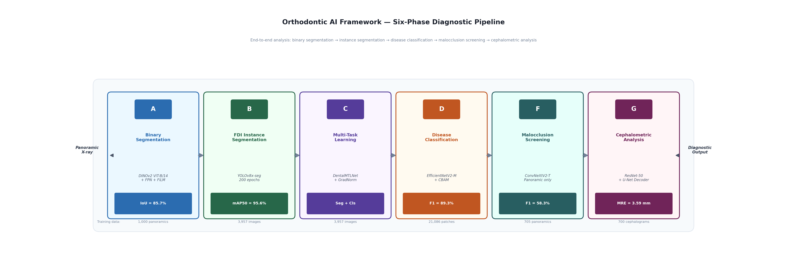

# OrthoVision
# OrthoVision

**An integrated deep learning pipeline for orthodontic diagnosis from panoramic and cephalometric radiographs.**

OrthoVision performs six diagnostic tasks from a single dental X-ray: tooth segmentation, per-tooth FDI labelling across 32 classes, disease classification, malocclusion screening, cephalometric landmark regression, and cervical vertebral maturation staging. It is trained entirely on public datasets, runs on a single consumer GPU, and ships with a FastAPI demo application for end-to-end analysis.

<p align="center">
  
</p>

---

## Why this exists

A clinician reading a panoramic radiograph performs several analyses at once — locating teeth, labelling them, spotting pathology, checking developmental stage. Most AI tools for dentistry solve only one of these in isolation and leave the integration to the clinician. OrthoVision is a single pipeline that mirrors the full visual workup.

The project is an undergraduate thesis (Computer Science, The Knowledge Hub Universities / Coventry University, 2026) released as open source for three reasons: reproducibility, reference, and as a starting point for anyone doing similar work who would benefit from not re-solving the problems this project already solved.

---

## Headline results

| Task | Metric | Result | Published baseline |
|------|--------|--------|-------------------|
| Binary tooth segmentation (clean 200) | IoU | **0.9105** | 0.8853 (STS-2024 winner) |
| Binary tooth segmentation (mixed val) | IoU | 0.8573 | — |
| FDI instance segmentation (32 classes) | mAP₅₀ᴹ | **0.956** | 0.836 (ChohoTech STS-2024) |
| Disease classification (3-class) | Macro F1 | **0.98** | ≈0.75 (Swin-B 2024) |
| Disease classification (3-class) | ROC-AUC | 0.9911 | — |
| Cephalometric landmarks | MRE (mm) | 3.59 | 1.789 (Aariz cascaded CNN) |
| Malocclusion screening | Binary F1 | 0.5826 | — |

Three tasks meet or exceed published baselines on comparable benchmarks. Two fall short, and the limitations section of the thesis explains exactly why (heuristic supervision for malocclusion, single-stage regression vs. cascaded baseline for landmarks). See the full thesis for the complete discussion.

---

## Architecture

OrthoVision is a six-phase sequential pipeline. Each phase is a distinct model trained on its own dataset.

| Phase | Task | Model | Dataset size |
|-------|------|-------|--------------|
| A | Binary tooth segmentation | DINOv2 ViT-B/14 + FPN decoder | 1,000 |
| B | FDI instance segmentation | YOLOv8x-seg | 3,957 |
| C | Multi-task learning | ResNet-50 shared encoder | 3,529 |
| D | Disease classification | EfficientNetV2-M + CBAM | 3,529 |
| F | Malocclusion screening | ConvNeXt-V2-T | 705 |
| G1 | Cephalometric landmarks | ResNet-50 + U-Net decoder | 700 |
| G2 | CVM staging | ConvNeXt-V2-T | 700 |

Phase A produces a coarse tooth map used for quality control. Phase B does the heavy lifting on per-tooth labelling. Phase D runs on the tooth patches extracted from Phase B. Phase G operates independently on lateral cephalograms. Phase F is a binary screen from the panoramic modality alone.

All models use transfer learning: DINOv2 pre-trained on 142M natural images, YOLOv8x pre-trained on COCO, EfficientNetV2/ConvNeXt-V2 pre-trained on ImageNet. None of the pre-training included dental data.

---

## Datasets

All training data is from public sources. No proprietary or hospital data is used.

| Dataset | Size | Source |
|---------|------|--------|
| DENTEX 2023 | 634 panoramic | [Zenodo](https://zenodo.org/records/7812323) |
| HITL (Humans-in-the-Loop) | 598 panoramic | [Kaggle](https://www.kaggle.com/datasets/humansintheloop/teeth-segmentation-on-dental-x-ray-images) |
| AKUDENTAL | 333 panoramic | [GitHub](https://github.com/MuhammadSohaib7/AKUDENTAL) |
| Dataset1 | 2,392 panoramic | Roboflow public |
| Aariz | 1,000 cephalometric | [GitHub](https://github.com/ahadch27/AARIZ-A-Benchmark-Dataset-for-Automatic-Cephalometric-Landmark-Detection-and-CVM-Stage-Classification) |

One thing worth flagging: DENTEX and the Supervisely-format datasets (HITL, Dataset1) use different quadrant orderings. DENTEX numbers centripetally, HITL numbers clockwise. Aggregating without correcting for this inverts the upper-right and lower-left quadrants silently. If you're reusing the dataset-loading code, the remapping is in `notebooks/orthovision_pipeline.ipynb`.

---

## Installation

**Requirements:** Python 3.10+, CUDA 12.x, 32 GB system RAM recommended. A GPU with ≥16 GB VRAM is needed for training; inference runs on 8 GB.

Clone and set up a virtual environment:

```bash
git clone https://github.com/YOUR-USERNAME/orthovision.git
cd orthovision
python -m venv venv
source venv/bin/activate          # Linux/Mac
venv\Scripts\activate             # Windows
pip install -r requirements.txt
```

Download the pre-trained checkpoints from the Google Drive link in the [Resources](#resources) section and place them under `DATA/processed/models_v4/`:

```
DATA/processed/models_v4/
├── seg_v23_best.pth              # Phase A
├── seg_instance_v23_best.pt      # Phase B
├── mtl_v23_best.pth              # Phase C
├── cls_v23_best.pth              # Phase D
├── mal_v23_best.pth              # Phase F
├── ceph_landmark_v23_best.pth    # Phase G1
└── cvm_v23_best.pth              # Phase G2
```

### Environment notes

- Tested on Windows 11 with an RTX 5090 (32 GB VRAM). Linux is not tested but should work.
- `num_workers=0` is set on all DataLoaders because multiprocessing workers deadlock on Windows Jupyter. You can raise this on Linux.
- Detectron2-based architectures (SemiTNet, Mask DINO) do not install cleanly on Windows with the RTX 5090 CUDA stack. This is why YOLOv8x-seg was chosen over Mask DINO for Phase B.

---

## Running the demo

A FastAPI web application wraps the four production-ready phases (B, D, G1, G2) into a single interface.

```bash
cd orthovision
uvicorn app:app --reload --port 8000
```

Then open `http://localhost:8000` in a browser. Upload a panoramic X-ray on the **Panoramic** tab or a lateral cephalogram on the **Cephalometric** tab. The server runs inference locally; no data leaves the machine.

Example images are included in `examples/` if you don't have your own radiographs to test with.

The interface is a prototype and has not been evaluated by clinicians. Do not use it for clinical decisions.

---

## Reproducing the results

The full training pipeline is in `notebooks/orthovision_pipeline.ipynb`. The notebook is structured phase by phase and re-runs end-to-end on a fresh kernel (expected runtime ~24 hours on an RTX 5090 for all phases).

Data download and preprocessing happen in the first few cells. Each phase has its own training cell block, and phase outputs are cached under `DATA/processed/` so you can re-run individual phases without redoing earlier ones.

If you only want to reproduce a specific phase, jump to its cell block and run from there. Phase D depends on Phase B having produced tooth patches; everything else is independent.

---

## Project structure

```
orthovision/
├── app.py                        # FastAPI demo server
├── static/
│   └── index.html                # Demo frontend
├── inference/
│   ├── models.py                 # Model registry
│   ├── panoramic.py              # Panoramic inference pipeline
│   └── cephalometric.py          # Cephalometric inference
├── utils/
│   ├── device.py                 # Device selection
│   └── visualization.py          # Overlay helpers
├── notebooks/
│   └── orthovision_pipeline.ipynb
├── docs/
│   ├── thesis.pdf                # Full thesis write-up
│   ├── thesis.tex                # LaTeX source
│   └── images/                   # Figures used in thesis and README
├── examples/
│   ├── panoramic/                # Sample panoramic X-rays
│   └── cephalometric/            # Sample cephalograms
├── requirements.txt
├── LICENSE
└── README.md                     # This file
```

---

## What worked, what didn't

Open about the negative results because they are useful for anyone extending this work.

**What worked:**

- DINOv2 self-supervised features transfer to dental X-rays without any dental pre-training. The Phase A IoU of 0.91 on clean data is within one point of the best published 2024 result.
- EfficientNetV2-M with CBAM attention outperforms the much larger Swin-B baseline on disease classification (0.89 vs. 0.75 macro F1 on the four-class split). Attention on the tooth patch matters more than raw model size.
- YOLOv8x-seg for 32-class FDI instance segmentation is a pragmatic choice for Windows environments where Mask DINO does not install.

**What didn't:**

- The shared-encoder multi-task formulation (Phase C) failed to train the classification head. The segmentation gradient dominated the shared encoder even with GradNorm balancing and a 4× initial classification weight. Single-task training won on both tasks individually.
- Phase G2 (CVM staging) collapsed to majority-class predictions. The cervical vertebrae occupy too small a fraction of a full-resolution cephalogram at 224×224 input size.
- Phase F (malocclusion screening) is bounded by label quality. The tooth-count heuristic correlates only weakly with true skeletal malocclusion.

See the thesis limitations section for the full post-mortem on each.

---

## Resources

- **Full thesis (PDF):** [`docs/thesis.pdf`](docs/thesis.pdf)
- **Pre-trained checkpoints and supplementary data (Google Drive):** https://drive.google.com/drive/folders/YOUR-FOLDER-ID
- **Demo video:** *to be added*

---

## Citation

If you use OrthoVision in your research or build on this work, please cite the thesis:

```bibtex
@thesis{tageldin2026orthovision,
  author       = {Tageldin, Abdelrahman},
  title        = {AI Framework for Orthodontic Diagnosis and Treatment Planning},
  school       = {The Knowledge Hub Universities, Coventry University},
  year         = {2026},
  type         = {Undergraduate thesis},
  url          = {https://github.com/YOUR-USERNAME/orthovision}
}
```

---

## License

Code in this repository is released under the MIT License. See [`LICENSE`](LICENSE) for details.

The pre-trained model checkpoints are released for research use. The datasets used for training are subject to their own licenses; see each dataset's documentation for terms.

---

## Acknowledgements

Supervised by Dr. Nada Ghaballah and Dr. Shereen at the School of Computing, The Knowledge Hub Universities (Coventry University).

Built on the open-source work of:

- Meta AI — DINOv2 self-supervised vision transformers
- Ultralytics — YOLOv8 segmentation framework
- Google Research — EfficientNetV2
- Facebook Research — ConvNeXt-V2
- The DENTEX 2023 and Aariz benchmark teams for public datasets

---

## Contact

For questions about the project, methodology, or collaboration:

- **Author:** Abdelrahman Tageldin
- **Location:** Cairo, Egypt
- **Email:** *your-email@domain.com*
- **LinkedIn:** *your-linkedin-url*

Issues and pull requests welcome.
